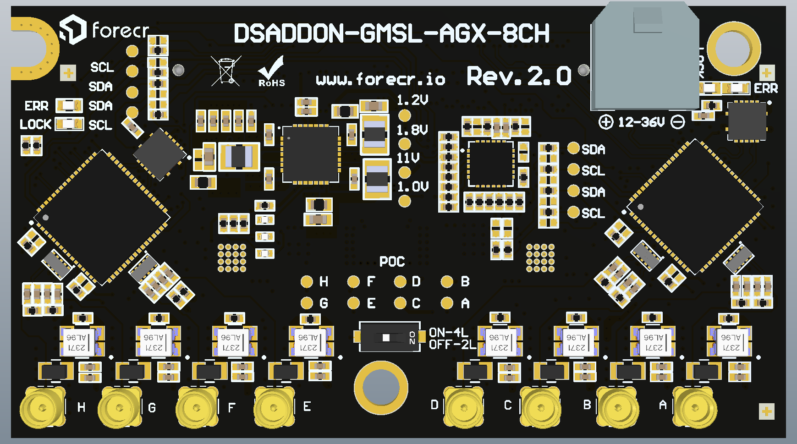
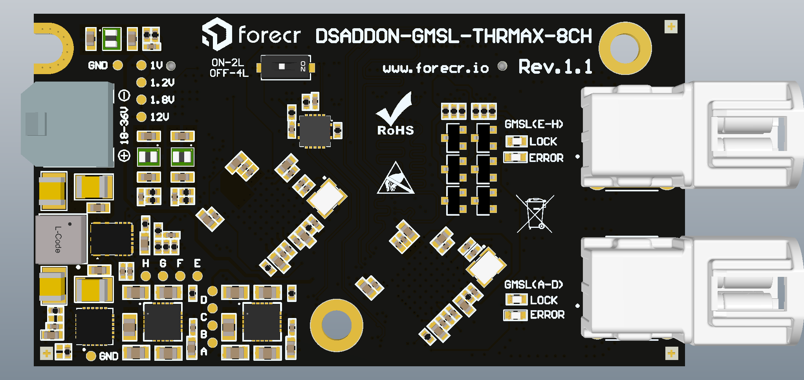
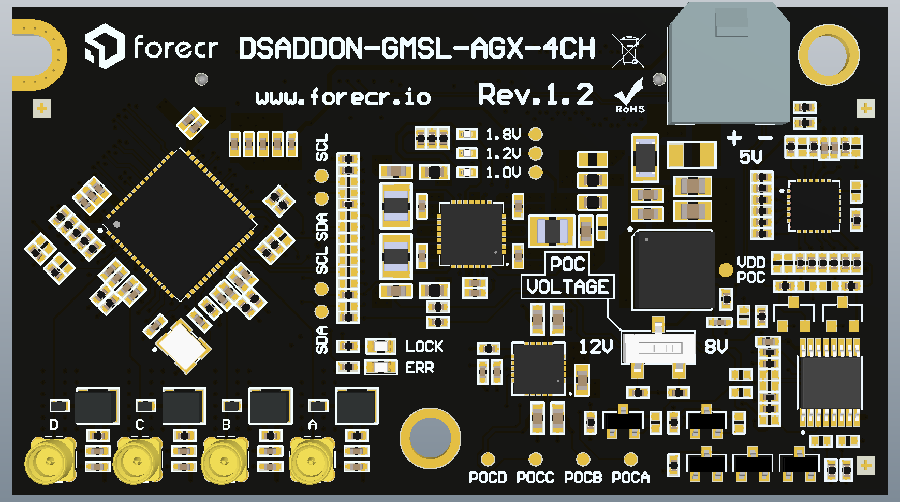

# jetson_gmsl_bsp

BSP packages for 4 and 8 channel GMSL board based forecr products

## ⚙️ Installation

1. Verify your platform (Orin / Thor) and the installed JetPack version:
   ```bash
   cat /etc/nv_tegra_release
   ```
2. Download the correct `.deb` file from the table above.
3. Perform the installation:
   ```bash
   sudo dpkg -i stereolabs-forecr-*arm64.deb
   sudo reboot
   ```
4. After rebooting, check that the camera is detected:
   ```bash
   v4l2-ctl --list-devices
   ```
## ⚙️ Uninstallation

1. Perform the installation then reboot:
   ```bash
   sudo dpkg -r stereolabs-forecr-*
   sudo reboot
   ```
## Install Argus
1.  Install related packages
  ```bash
  sudo apt install nvidia-l4t-jetson-multimedia-api cmake build-essential pkg-config libx11-dev libgtk-3-dev libexpat1-dev libjpeg-dev libgstreamer1.0-dev
  ```
2. Go to argus directory
  ```bash
  cd /usr/src/jetson_multimedia_api/argus/
  ```
3. Build and Install argus_camera
  ```bash
  mkdir build && cd build
  sudo cmake .. && sudo make -j $(nproc)
  sudo make install
  ```

## DSADDON-GMSL-AGX-8CH (experimental)



<table>
  <thead>
    <tr>
      <th align="center">JetPack Version</th>
      <th align="center">AGX Orin</th>
      <th align="center">Orin NX/Nano</th>
      <th align="center">Thor</th>
    </tr>
  </thead>
  <tbody>
    <tr>
      <td align="center"><b>7.2</b></td>
      <td align="center"><a href="releases/agx/stereolabs-forecr-agx-8ch-gmsl-for-agx_1.4.3-L4T39.2.1_arm64.deb">⬇ Download</a></td>
      <td align="center"><a href="releases/ornx/stereolabs-forecr-agx-8ch-gmsl-for-ornx_1.4.3-L4T39.2.1_arm64.deb">⬇ Download</a></td>
      <td align="center"><a href="releases/thor/stereolabs-forecr-agx-8ch-gmsl-for-thor_1.4.3-L4T39.2.1_arm64.deb">⬇ Download</a></td>
    </tr>
        <tr>
      <td align="center"><b>7.2 RT</b></td>
      <td align="center"><a href="releases/agx/stereolabs-forecr-agx-8ch-gmsl-for-agx_1.4.3-rt-L4T39.2.1_arm64.deb">⬇ Download</a></td>
      <td align="center"><a href="releases/ornx/stereolabs-forecr-agx-8ch-gmsl-for-ornx_1.4.3-rt-L4T39.2.1_arm64.deb">⬇ Download</a></td>
      <td align="center"><a href="releases/thor/stereolabs-forecr-agx-8ch-gmsl-for-thor_1.4.3-rt-L4T39.2.1_arm64.deb">⬇ Download</a></td>
    </tr>
    <tr>
      <td align="center"><b>7.1</b></td>
      <td align="center">—</td>
      <td align="center">—</td>
      <td align="center"><a href="releases/thor/stereolabs-forecr-agx-8ch-gmsl-for-thor_1.4.3-L4T38.4.1_arm64.deb">⬇ Download</a></td>
    </tr>
        <tr>
      <td align="center"><b>7.1 RT</b></td>
      <td align="center">—</td>
      <td align="center">—</td>
      <td align="center"><a href="releases/thor/stereolabs-forecr-agx-8ch-gmsl-for-thor_1.4.3-rt-L4T38.4.1_arm64.deb">⬇ Download</a></td>
    </tr>
    <tr>
      <td align="center"><b>7.0</b></td>
      <td align="center">—</td>
      <td align="center">—</td>
      <td align="center"><a href="releases/thor/stereolabs-forecr-agx-8ch-gmsl-for-thor_1.4.3-L4T38.2.1_arm64.deb">⬇ Download</a></td>
    </tr>
        <tr>
      <td align="center"><b>7.0 RT</b></td>
      <td align="center">—</td>
      <td align="center">—</td>
      <td align="center"><a href="releases/thor/stereolabs-forecr-agx-8ch-gmsl-for-thor_1.4.3-rt-L4T38.2.1_arm64.deb">⬇ Download</a></td>
    </tr>
    <tr>
      <td align="center"><b>6.2.2</b></td>
      <td align="center"><a href="releases/agx/stereolabs-forecr-agx-8ch-gmsl-for-agx_1.4.3-L4T36.5.0_arm64.deb">⬇ Download</a></td>
      <td align="center"><a href="releases/ornx/stereolabs-forecr-agx-8ch-gmsl-for-ornx_1.4.3-L4T36.5.0_arm64.deb">⬇ Download</a></td>
      <td align="center">—</td>
    </tr>
        <tr>
      <td align="center"><b>6.2.2 RT</b></td>
      <td align="center"><a href="releases/agx/stereolabs-forecr-agx-8ch-gmsl-for-agx_1.4.3-rt-L4T36.5.0_arm64.deb">⬇ Download</a></td>
      <td align="center"><a href="releases/ornx/stereolabs-forecr-agx-8ch-gmsl-for-ornx_1.4.3-rt-L4T36.5.0_arm64.deb">⬇ Download</a></td>
      <td align="center">—</td>
    </tr>
    <tr>
      <td align="center"><b>6.2.1</b></td>
      <td align="center"><a href="releases/agx/stereolabs-forecr-agx-8ch-gmsl-for-agx_1.4.3-L4T36.4.0_arm64.deb">⬇ Download</a></td>
      <td align="center"><a href="releases/ornx/stereolabs-forecr-agx-8ch-gmsl-for-ornx_1.4.3-L4T36.4.0_arm64.deb">⬇ Download</a></td>
      <td align="center">—</td>
    </tr>
        <tr>
      <td align="center"><b>6.2.1 RT</b></td>
      <td align="center"><a href="releases/agx/stereolabs-forecr-agx-8ch-gmsl-for-agx_1.4.3-rt-L4T36.4.0_arm64.deb">⬇ Download</a></td>
      <td align="center"><a href="releases/ornx/stereolabs-forecr-agx-8ch-gmsl-for-ornx_1.4.3-rt-L4T36.4.0_arm64.deb">⬇ Download</a></td>
      <td align="center">—</td>
    </tr>
    <tr>
      <td align="center"><b>6.2</b></td>
      <td align="center"><a href="releases/agx/stereolabs-forecr-agx-8ch-gmsl-for-agx_1.4.3-L4T36.4.0_arm64.deb">⬇ Download</a></td>
      <td align="center"><a href="releases/ornx/stereolabs-forecr-agx-8ch-gmsl-for-ornx_1.4.3-L4T36.4.0_arm64.deb">⬇ Download</a></td>
      <td align="center">—</td>
    </tr>
        <tr>
      <td align="center"><b>6.2 RT</b></td>
      <td align="center"><a href="releases/agx/stereolabs-forecr-agx-8ch-gmsl-for-agx_1.4.3-rt-L4T36.4.0_arm64.deb">⬇ Download</a></td>
      <td align="center"><a href="releases/ornx/stereolabs-forecr-agx-8ch-gmsl-for-ornx_1.4.3-rt-L4T36.4.0_arm64.deb">⬇ Download</a></td>
      <td align="center">—</td>
    </tr>
    <tr>
      <td align="center"><b>6.1</b></td>
      <td align="center"><a href="releases/agx/stereolabs-forecr-agx-8ch-gmsl-for-agx_1.4.3-L4T36.4.0_arm64.deb">⬇ Download</a></td>
      <td align="center"><a href="releases/ornx/stereolabs-forecr-agx-8ch-gmsl-for-ornx_1.4.3-L4T36.4.0_arm64.deb">⬇ Download</a></td>
      <td align="center">—</td>
    </tr>
        <tr>
      <td align="center"><b>6.1 RT</b></td>
      <td align="center"><a href="releases/agx/stereolabs-forecr-agx-8ch-gmsl-for-agx_1.4.3-rt-L4T36.4.0_arm64.deb">⬇ Download</a></td>
      <td align="center"><a href="releases/ornx/stereolabs-forecr-agx-8ch-gmsl-for-ornx_1.4.3-rt-L4T36.4.0_arm64.deb">⬇ Download</a></td>
      <td align="center">—</td>
    </tr>
    <tr>
      <td align="center"><b>6.0</b></td>
      <td align="center"><a href="releases/agx/stereolabs-forecr-agx-8ch-gmsl-for-agx_1.4.3-L4T36.3.0_arm64.deb">⬇ Download</a></td>
      <td align="center"><a href="releases/ornx/stereolabs-forecr-agx-8ch-gmsl-for-ornx_1.4.3-L4T36.3.0_arm64.deb">⬇ Download</a></td>
      <td align="center">—</td>
    </tr>
        <tr>
      <td align="center"><b>6.0 RT</b></td>
      <td align="center"><a href="releases/agx/stereolabs-forecr-agx-8ch-gmsl-for-agx_1.4.3-rt-L4T36.3.0_arm64.deb">⬇ Download</a></td>
      <td align="center"><a href="releases/ornx/stereolabs-forecr-agx-8ch-gmsl-for-ornx_1.4.3-rt-L4T36.3.0_arm64.deb">⬇ Download</a></td>
      <td align="center">—</td>
    </tr>
  </tbody>
</table>

## DSADDON-GMSL-THRMAX-8CH (experimental)



<table>
  <thead>
    <tr>
      <th align="center">JetPack Version</th>
      <th align="center">AGX Orin</th>
      <th align="center">Orin NX/Nano</th>
      <th align="center">Thor</th>
    </tr>
  </thead>
  <tbody>
    <tr>
      <td align="center"><b>7.2</b></td>
      <td align="center"><a href="releases/agx/stereolabs-forecr-agx-8ch-gmsl-for-agx_1.4.3-L4T39.2.1_arm64.deb">⬇ Download</a></td>
      <td align="center"><a href="releases/ornx/stereolabs-forecr-agx-8ch-gmsl-for-ornx_1.4.3-L4T39.2.1_arm64.deb">⬇ Download</a></td>
      <td align="center"><a href="releases/thor/stereolabs-forecr-agx-8ch-gmsl-for-thor_1.4.3-L4T39.2.1_arm64.deb">⬇ Download</a></td>
    </tr>
        <tr>
      <td align="center"><b>7.2 RT</b></td>
      <td align="center"><a href="releases/agx/stereolabs-forecr-agx-8ch-gmsl-for-agx_1.4.3-rt-L4T39.2.1_arm64.deb">⬇ Download</a></td>
      <td align="center"><a href="releases/ornx/stereolabs-forecr-agx-8ch-gmsl-for-ornx_1.4.3-rt-L4T39.2.1_arm64.deb">⬇ Download</a></td>
      <td align="center"><a href="releases/thor/stereolabs-forecr-agx-8ch-gmsl-for-thor_1.4.3-rt-L4T39.2.1_arm64.deb">⬇ Download</a></td>
    </tr>
    <tr>
      <td align="center"><b>7.1</b></td>
      <td align="center">—</td>
      <td align="center">—</td>
      <td align="center"><a href="releases/thor/stereolabs-forecr-agx-8ch-gmsl-for-thor_1.4.3-L4T38.4.1_arm64.deb">⬇ Download</a></td>
    </tr>
        <tr>
      <td align="center"><b>7.1 RT</b></td>
      <td align="center">—</td>
      <td align="center">—</td>
      <td align="center"><a href="releases/thor/stereolabs-forecr-agx-8ch-gmsl-for-thor_1.4.3-rt-L4T38.4.1_arm64.deb">⬇ Download</a></td>
    </tr>
    <tr>
      <td align="center"><b>7.0</b></td>
      <td align="center">—</td>
      <td align="center">—</td>
      <td align="center"><a href="releases/thor/stereolabs-forecr-agx-8ch-gmsl-for-thor_1.4.3-L4T38.2.1_arm64.deb">⬇ Download</a></td>
    </tr>
        <tr>
      <td align="center"><b>7.0 RT</b></td>
      <td align="center">—</td>
      <td align="center">—</td>
      <td align="center"><a href="releases/thor/stereolabs-forecr-agx-8ch-gmsl-for-thor_1.4.3-rt-L4T38.2.1_arm64.deb">⬇ Download</a></td>
    </tr>
    <tr>
      <td align="center"><b>6.2.2</b></td>
      <td align="center"><a href="releases/agx/stereolabs-forecr-agx-8ch-gmsl-for-agx_1.4.3-L4T36.5.0_arm64.deb">⬇ Download</a></td>
      <td align="center"><a href="releases/ornx/stereolabs-forecr-agx-8ch-gmsl-for-ornx_1.4.3-L4T36.5.0_arm64.deb">⬇ Download</a></td>
      <td align="center">—</td>
    </tr>
        <tr>
      <td align="center"><b>6.2.2 RT</b></td>
      <td align="center"><a href="releases/agx/stereolabs-forecr-agx-8ch-gmsl-for-agx_1.4.3-rt-L4T36.5.0_arm64.deb">⬇ Download</a></td>
      <td align="center"><a href="releases/ornx/stereolabs-forecr-agx-8ch-gmsl-for-ornx_1.4.3-rt-L4T36.5.0_arm64.deb">⬇ Download</a></td>
      <td align="center">—</td>
    </tr>
    <tr>
      <td align="center"><b>6.2.1</b></td>
      <td align="center"><a href="releases/agx/stereolabs-forecr-agx-8ch-gmsl-for-agx_1.4.3-L4T36.4.0_arm64.deb">⬇ Download</a></td>
      <td align="center"><a href="releases/ornx/stereolabs-forecr-agx-8ch-gmsl-for-ornx_1.4.3-L4T36.4.0_arm64.deb">⬇ Download</a></td>
      <td align="center">—</td>
    </tr>
        <tr>
      <td align="center"><b>6.2.1 RT</b></td>
      <td align="center"><a href="releases/agx/stereolabs-forecr-agx-8ch-gmsl-for-agx_1.4.3-rt-L4T36.4.0_arm64.deb">⬇ Download</a></td>
      <td align="center"><a href="releases/ornx/stereolabs-forecr-agx-8ch-gmsl-for-ornx_1.4.3-rt-L4T36.4.0_arm64.deb">⬇ Download</a></td>
      <td align="center">—</td>
    </tr>
    <tr>
      <td align="center"><b>6.2</b></td>
      <td align="center"><a href="releases/agx/stereolabs-forecr-agx-8ch-gmsl-for-agx_1.4.3-L4T36.4.0_arm64.deb">⬇ Download</a></td>
      <td align="center"><a href="releases/ornx/stereolabs-forecr-agx-8ch-gmsl-for-ornx_1.4.3-L4T36.4.0_arm64.deb">⬇ Download</a></td>
      <td align="center">—</td>
    </tr>
        <tr>
      <td align="center"><b>6.2 RT</b></td>
      <td align="center"><a href="releases/agx/stereolabs-forecr-agx-8ch-gmsl-for-agx_1.4.3-rt-L4T36.4.0_arm64.deb">⬇ Download</a></td>
      <td align="center"><a href="releases/ornx/stereolabs-forecr-agx-8ch-gmsl-for-ornx_1.4.3-rt-L4T36.4.0_arm64.deb">⬇ Download</a></td>
      <td align="center">—</td>
    </tr>
    <tr>
      <td align="center"><b>6.1</b></td>
      <td align="center"><a href="releases/agx/stereolabs-forecr-agx-8ch-gmsl-for-agx_1.4.3-L4T36.4.0_arm64.deb">⬇ Download</a></td>
      <td align="center"><a href="releases/ornx/stereolabs-forecr-agx-8ch-gmsl-for-ornx_1.4.3-L4T36.4.0_arm64.deb">⬇ Download</a></td>
      <td align="center">—</td>
    </tr>
        <tr>
      <td align="center"><b>6.1 RT</b></td>
      <td align="center"><a href="releases/agx/stereolabs-forecr-agx-8ch-gmsl-for-agx_1.4.3-rt-L4T36.4.0_arm64.deb">⬇ Download</a></td>
      <td align="center"><a href="releases/ornx/stereolabs-forecr-agx-8ch-gmsl-for-ornx_1.4.3-rt-L4T36.4.0_arm64.deb">⬇ Download</a></td>
      <td align="center">—</td>
    </tr>
    <tr>
      <td align="center"><b>6.0</b></td>
      <td align="center"><a href="releases/agx/stereolabs-forecr-agx-8ch-gmsl-for-agx_1.4.3-L4T36.3.0_arm64.deb">⬇ Download</a></td>
      <td align="center"><a href="releases/ornx/stereolabs-forecr-agx-8ch-gmsl-for-ornx_1.4.3-L4T36.3.0_arm64.deb">⬇ Download</a></td>
      <td align="center">—</td>
    </tr>
        <tr>
      <td align="center"><b>6.0 RT</b></td>
      <td align="center"><a href="releases/agx/stereolabs-forecr-agx-8ch-gmsl-for-agx_1.4.3-rt-L4T36.3.0_arm64.deb">⬇ Download</a></td>
      <td align="center"><a href="releases/ornx/stereolabs-forecr-agx-8ch-gmsl-for-ornx_1.4.3-rt-L4T36.3.0_arm64.deb">⬇ Download</a></td>
      <td align="center">—</td>
    </tr>
  </tbody>
</table>

## DSADDON-GMSL-AGX-4CH (experimental)



<table>
  <thead>
    <tr>
      <th align="center">JetPack Version</th>
      <th align="center">AGX Orin</th>
      <th align="center">Orin NX/Nano</th>
      <th align="center">Thor</th>
    </tr>
  </thead>
  <tbody>
    <tr>
      <td align="center"><b>7.2</b></td>
      <td align="center"><a href="releases/agx/stereolabs-forecr-agx-4ch-gmsl-for-agx_1.4.3-L4T39.2.1_arm64.deb">⬇ Download</a></td>
      <td align="center">—</td>
      <td align="center">—</td>
    </tr>
    <tr>
      <td align="center"><b>7.2 RT</b></td>
      <td align="center"><a href="releases/agx/stereolabs-forecr-agx-4ch-gmsl-for-agx_1.4.3-rt-L4T39.2.1_arm64.deb">⬇ Download</a></td>
      <td align="center">—</td>
      <td align="center">—</td>
    </tr>
    <tr>
      <td align="center"><b>7.1</b></td>
      <td align="center">—</td>
      <td align="center">—</td>
      <td align="center">—</td>
    </tr>
    <tr>
      <td align="center"><b>7.0</b></td>
      <td align="center">—</td>
      <td align="center">—</td>
      <td align="center">—</td>
    </tr>
    <tr>
      <td align="center"><b>6.2.2</b></td>
      <td align="center"><a href="releases/agx/stereolabs-forecr-agx-4ch-gmsl-for-agx_1.4.3-L4T36.5.0_arm64.deb">⬇ Download</a></td>
      <td align="center">—</td>
      <td align="center">—</td>
    </tr>
    <tr>
      <td align="center"><b>6.2.2 RT</b></td>
      <td align="center"><a href="releases/agx/stereolabs-forecr-agx-4ch-gmsl-for-agx_1.4.3-rt-L4T36.5.0_arm64.deb">⬇ Download</a></td>
      <td align="center">—</td>
      <td align="center">—</td>
    </tr>
    <tr>
      <td align="center"><b>6.2.1</b></td>
      <td align="center"><a href="releases/agx/stereolabs-forecr-agx-4ch-gmsl-for-agx_1.4.3-L4T36.4.0_arm64.deb">⬇ Download</a></td>
      <td align="center">—</td>
      <td align="center">—</td>
    </tr>
    <tr>
      <td align="center"><b>6.2.1 RT</b></td>
      <td align="center"><a href="releases/agx/stereolabs-forecr-agx-4ch-gmsl-for-agx_1.4.3-rt-L4T36.4.0_arm64.deb">⬇ Download</a></td>
      <td align="center">—</td>
      <td align="center">—</td>
    </tr>
    <tr>
      <td align="center"><b>6.2</b></td>
      <td align="center"><a href="releases/agx/stereolabs-forecr-agx-4ch-gmsl-for-agx_1.4.3-L4T36.4.0_arm64.deb">⬇ Download</a></td>
      <td align="center">—</td>
      <td align="center">—</td>
    </tr>
    <tr>
      <td align="center"><b>6.2 RT</b></td>
      <td align="center"><a href="releases/agx/stereolabs-forecr-agx-4ch-gmsl-for-agx_1.4.3-rt-L4T36.4.0_arm64.deb">⬇ Download</a></td>
      <td align="center">—</td>
      <td align="center">—</td>
    </tr>
    <tr>
      <td align="center"><b>6.1</b></td>
      <td align="center"><a href="releases/agx/stereolabs-forecr-agx-4ch-gmsl-for-agx_1.4.3-L4T36.4.0_arm64.deb">⬇ Download</a></td>
      <td align="center">—</td>
      <td align="center">—</td>
    </tr>
    <tr>
      <td align="center"><b>6.1 RT</b></td>
      <td align="center"><a href="releases/agx/stereolabs-forecr-agx-4ch-gmsl-for-agx_1.4.3-rt-L4T36.4.0_arm64.deb">⬇ Download</a></td>
      <td align="center">—</td>
      <td align="center">—</td>
    </tr>
    <tr>
      <td align="center"><b>6.0</b></td>
      <td align="center"><a href="releases/agx/stereolabs-forecr-agx-4ch-gmsl-for-agx_1.4.3-L4T36.3.0_arm64.deb">⬇ Download</a></td>
      <td align="center">—</td>
      <td align="center">—</td>
    </tr>
    <tr>
      <td align="center"><b>6.0 RT</b></td>
      <td align="center"><a href="releases/agx/stereolabs-forecr-agx-4ch-gmsl-for-agx_1.4.3-rt-L4T36.3.0_arm64.deb">⬇ Download</a></td>
      <td align="center">—</td>
      <td align="center">—</td>
    </tr>
  </tbody>
</table>


## ZED SDK
<table>
  <thead>
    <tr>
      <th align="center">JetPack Version</th>
      <th align="center">Latest Version</th>
    </tr>
  </thead>
  <tbody>
    <tr>
      <td align="center"><b>7.2</b></td>
      <td align="center"><a href="releases/zed-sdk/ZED_SDK_Tegra_L4T39.2_v5.4.1.zstd.run">⬇ Zed SDK 5.4.1</a></td>
    </tr>
    <tr>
      <td align="center"><b>7.1</b></td>
      <td align="center"><a href="releases/zed-sdk/ZED_SDK_Tegra_L4T38.4_v5.4.1.zstd.run">⬇ Zed SDK 5.4.1</a></td>
    </tr>
    <tr>
      <td align="center"><b>7.0</b></td>
      <td align="center"><a href="releases/zed-sdk/ZED_SDK_Tegra_L4T38.2_v5.4.1.zstd.run">⬇ Zed SDK 5.4.1</a></td>
    </tr>
    <tr>
      <td align="center"><b>6.2.2</b></td>
      <td align="center"><a href="releases/zed-sdk/ZED_SDK_Tegra_L4T36.5_v5.4.1.zstd.run">⬇ Zed SDK 5.4.1</a></td>
    </tr>
    <tr>
      <td align="center"><b>6.2.1</b></td>
      <td align="center"><a href="releases/zed-sdk/ZED_SDK_Tegra_L4T36.4_v5.4.1.zstd.run">⬇ Zed SDK 5.4.1</a></td>
    </tr>
    <tr>
      <td align="center"><b>6.2</b></td>
      <td align="center"><a href="releases/zed-sdk/ZED_SDK_Tegra_L4T36.4_v5.4.1.zstd.run">⬇ Zed SDK 5.4.1</a></td>
    </tr>
    <tr>
      <td align="center"><b>6.1</b></td>
      <td align="center"><a href="releases/zed-sdk/ZED_SDK_Tegra_L4T36.4_v5.4.1.zstd.run">⬇ Zed SDK 5.4.1</a></td>
    </tr>
    <tr>
      <td align="center"><b>6.0</b></td>
      <td align="center"><a href="releases/zed-sdk/ZED_SDK_Tegra_L4T36.3_v5.2.3.zstd.run">⬇ Zed SDK 5.2.3</a></td>
    </tr>
  </tbody>
</table>


## 📌 Release Notes

| Date       | Note                   |
|------------|------------------------|
| 07-08-2026 | Added 1.4.3 RT drivers |
| 06-08-2026 | Tested deb files       |
| 01-08-2026 | Added 1.4.3            |
